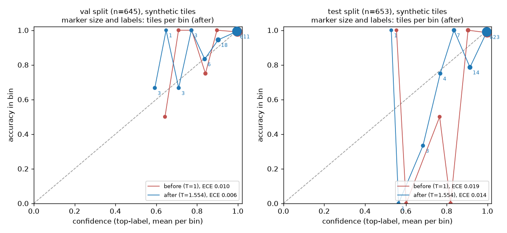

# QC classifier calibration (Phase A5)

Generated by `scripts/calibrate_classifier.py` from `cache/logits.parquet` (model `qc_effnetb0_v1`), joined with `data/tiles/manifest.csv`. **Provenance: synthetic** (data/tiles/, the classifier's own synthetic tile set).

Temperature fit on **val** (n=645) by NLL: **T = 1.5536** (stored in `configs/calibration.yaml`).

ECE: top-label, 15 equal-width bins. Per-class ECE: one-vs-rest, p(class) against 'label is that class' (the quantity A6's failure-class residual trends).

| split | stage | n | accuracy | NLL | ECE | ECE normal | ECE contamination_suspected | ECE detachment | ECE image_quality |
|---|---|---|---|---|---|---|---|---|---|
| val | before | 645 | 0.9876 | 0.0529 | 0.0102 | 0.0107 | 0.0001 | 0.0001 | 0.0107 |
| val | after | 645 | 0.9876 | 0.0445 | 0.0057 | 0.0079 | 0.0006 | 0.0007 | 0.0097 |
| test | before | 653 | 0.9801 | 0.0929 | 0.0187 | 0.0194 | 0.0001 | 0.0003 | 0.0192 |
| test | after | 653 | 0.9801 | 0.0686 | 0.0139 | 0.0151 | 0.0006 | 0.0008 | 0.0159 |
| train | before | 2702 | 0.9978 | 0.0058 | 0.0011 | 0.0022 | 0.0001 | 0.0000 | 0.0022 |
| train | after | 2702 | 0.9978 | 0.0090 | 0.0050 | 0.0057 | 0.0005 | 0.0003 | 0.0057 |

Bins are sparse below the top one: after scaling, 611/645 val tiles are in the top bin (confidence > 0.933), 623/653 test tiles are in the top bin (confidence > 0.933). The lower bins hold a handful of tiles each, so their points in the diagram are noisy.

**V8 (ECE on val after temperature scaling ≤ 0.05): pass** (0.0057). This is in-sample: T was fit on val. Test (0.0139) is the held-out figure.

What this does and doesn't show: calibration on the classifier's own synthetic tiles. The tiles share generators and backgrounds with the training set and accuracy on them is high, so a low ECE here says little about calibration on real C2C12 frames or on shifted backgrounds (B3). Train-split rows are for reference only (the classifier was trained on them).

