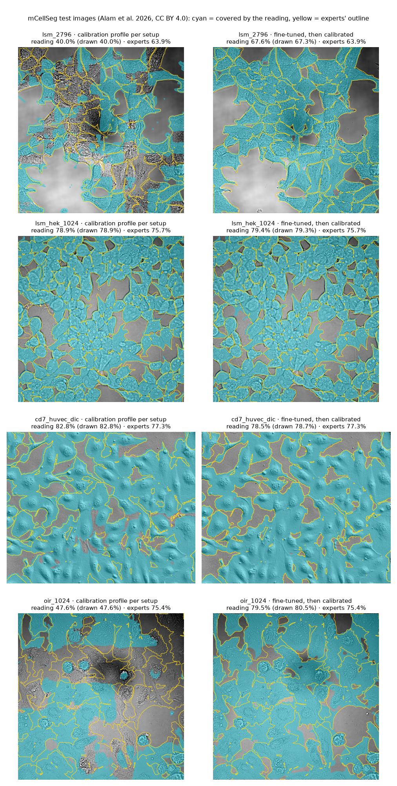

# Before/after picture: what calibration covers, what fine-tuning covers

Generated by `scripts/confluency_finetune_figure.py figure` from `results/confluency_finetune_figure_curves.json` (computed on NVIDIA A100-SXM4-40GB, commit `5e24fa4`).

**Not a new result.** The test in `results/confluency_mcellseg.md` was scored once. The fine-tuned model it scored was not kept, so this picture is drawn with `mcellseg_ftF_r2`, retrained with the same recipe on the same 79 calibration images (weights SHA-256 `2d1549682c1da482…`). Its readings are compared with the scored model's, never with the experts.

- Retrained against scored fine-tuned readings, all 90 test images, at each setup's F cutoff: mean -0.04 pp, mean absolute 0.23 pp, largest 1.52 pp.
- Zero-shot readings of the drawn images against the committed ones, every cutoff: largest difference 0.012 pp.

Drawn: one test image per setup, the one at 60–90% closest to 75% (rule fixed before the run). Each drawn fine-tuned reading is within 2.0 pp of the scored one. 'reading' is the scored test's; '(drawn …)' is the coverage shown, recomputed on the GPU at full resolution: the shipped model at the calibrated cutoff on the left, the retrained model at the fine-tuned cutoff on the right.

