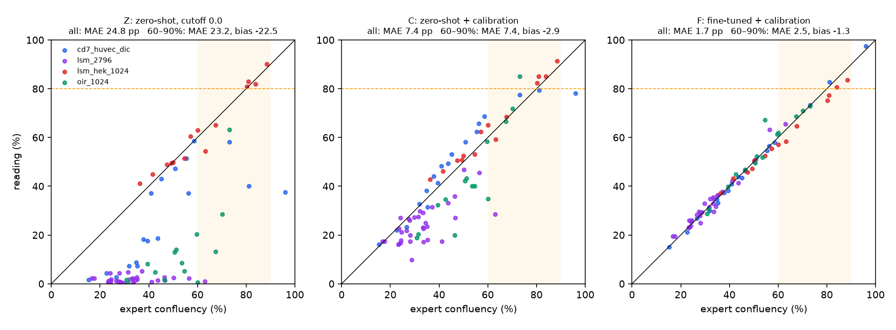

# Replication with the halves swapped: the mCellSeg passage-range test, run the other way round

**Status: pre-registration.** This section was committed before any fine-tuned model was trained on the
images below, and before any swapped reading was computed. The results section is added afterwards by
`scripts/confluency_mcellseg_swap.py score`.

## Why

The sealed test (`results/confluency_mcellseg.md`) was scored once, on 2026-10-06. Its pre-registered
comparison held: fine-tuning read the 60–90% test images closer to the experts than calibration alone,
MAE(C) − MAE(F) = +4.45 pp (95% interval +0.83 to +7.94). That rests on 22 dense images from 17 units, and only
4 test images were at or above 80%.

The obvious next step would be to adjust the recipe where it fell short, and that would be tuning on a test set
that has now been seen. This replication changes nothing. It runs the same procedure with the roles of the two
halves exchanged, so every number comes from images that the models being scored never trained on. The
question:

1. Does fine-tuning again read the passage range better than calibration alone, when the models are trained on
   the other half?

## What was looked at before this was written

Disclosed in full, because it bears on how new this evidence is:

- **All of the sealed test's results**, per image (`results/confluency_mcellseg.csv`).
- **The zero-shot readings of all 200 images** at every cutoff, committed in `007422d`. C's readings of the
  images tested here can therefore be computed from committed files. They have not been computed or looked at
  as a test, but C's calibration MAE on these images, at the sealed test's cutoffs, is in that test's results
  (`cd7_huvec_dic` 5.52, `lsm_hek_1024` 2.71, `oir_1024` 10.73 and `lsm_2796` 8.77 pp).
- **F's out-of-fold readings of these images.** In the sealed test, these 79 images were read by fine-tuned
  models trained on the other half of the same 79 (folds A and B). Their calibration MAEs are in that test's
  results (`cd7_huvec_dic` 0.97, `lsm_hek_1024` 1.23, `oir_1024` 2.76 and `lsm_2796` 2.71 pp). The models scored here are different: they train on the other 90
  images and have never seen any of these 79.
- **Counts from the masks** (below).

## What stays the same

Everything in `results/confluency_mcellseg.md` except the roles of the halves:

- The same four setups (`cd7_huvec_dic`, `lsm_hek_1024`, `oir_1024`, `lsm_2796`) and the committed units
  (`results/confluency_mcellseg_split.json`). After the swap `polymer_lowmag` would have 9 calibration
  images, all from one unit; it stays out, as before.
- The same reading, grid (−4.0 … +1.0, step 0.5), cutoff choice (`confluency_profiles.pick`), band
  (`confluency_profiles.band`), rules_v0.5 at T = 80, criteria B1–B5 with the same limits, and the same
  bootstrap (units resampled, 10,000 resamples, `numpy.random.default_rng(0)`).
- The same fine-tuning recipe (Cellpose-SAM `cpsam_v2`; learning rate 1e-5, weight decay 0.1, 100 epochs,
  batch size 1), not tuned in reaction to the sealed test. The same cross-fit: units of each setup, ranked by
  mean expert confluency, alternate folds A and B. One model trains on B and reads A, another trains on A and
  reads B, and a third trains on all 90 and reads the test images.
- The functions are imported from `scripts/confluency_mcellseg.py`, unchanged since `001a256`.

## Arms

- **Z: zero-shot, cutoff 0.0, no band.**
- **C: zero-shot plus a calibration profile per setup** (the shipped method), fitted on the 90 swapped
  calibration images.
- **F: fine-tuned on the 90 swapped calibration images, then calibrated**, with the cutoff and band from the
  out-of-fold readings.
- R is dropped: it was secondary in the sealed test and did not help.

## Test set (masks and file names only)

| setup | calibration images (units) | test images (units) | test at 60–90% | test at ≥ 80% |
|---|---|---|---|---|
| `cd7_huvec_dic` | 18 (17) | 18 (18) | 2 | 2 |
| `lsm_hek_1024` | 18 (6) | 14 (7) | 6 | 4 |
| `oir_1024` | 17 (6) | 14 (6) | 4 | 0 |
| `lsm_2796` | 37 (10) | 33 (10) | 1 | 0 |

79 test images: 13 at 60–90% (from 10 units), 14 at 60–100%, and 6 at or above 80% (from 6 units).

## Pre-registered comparison

- **Primary.** Fine-tuning replicates if the 95% interval of MAE(C) − MAE(F) on the 13 test images at 60–90%
  lies entirely above zero.
  - With 10 dense units the interval will be wide. A replication that does not exclude zero may say more about
    the size of this half than about fine-tuning; both outcomes are reported as they come.
- B1–B5 are judged for each arm exactly as in the sealed test. B2, B3 and B4 are measurable here (13 and 14
  images).
- **Secondary, both halves together.** Every one of the 169 images has now been read by models that never
  trained on it: the sealed test's 90 by the sealed test's models, and these 79 by this replication's models.
  B1–B5 and the same contrast are reported over all 169, with units resampled. The sealed test's rows are
  recomputed from its committed curves and checked against its committed CSV.

## Compute

- The three fine-tuning runs and their maps run on a Colab GPU (`nb/07_confluency_replication.ipynb`), from a
  bundle of this commit. The maps are reduced to readings at every grid cutoff
  (`results/confluency_mcellseg_swap_curves.json`, with the runs' manifests).
- `score` reads only that file and the committed `results/confluency_mcellseg_curves.json`, on the Mac, once.

## What it cannot show

- Everything the sealed test could not show still applies: 20× and 40× images, one lab, two cell lines, setups
  inferred from formats, and masks drawn with fluorescence to help.
- This is the same dataset cut the other way. It can show that the result does not depend on which half
  trained the models, but it is not a second lab or microscope.
- The two halves were split to span the density range, so the two estimates are not independent draws.

## What changes downstream

Nothing in the product. The fine-tuned weights are a measurement only: they inherit Cellpose-SAM's
non-commercial status (`README.md`, "Licences and commercial use").

## Also in this Colab run (not part of this test)

A fine-tuned model for the MSC setup the product already reads, trained so the repository owner can decide
whether to propose a fine-tuned MSC profile. Its training set is fixed here, before training: 20 images drawn
at random (`numpy.random.default_rng(0)`) from all 320 MSC images (8 from 218-5, 6 each from 218-4 and 218-6;
`scripts/confluency_finetune.py final`). None is a product example image. Any cutoff and band for such a
profile would come from the development runs' out-of-population readings, which are already committed
(`results/confluency_finetune_dev_curves.json`). Nothing in the product loads this model.

## Results

Scored 2026-10-06 by `scripts/confluency_mcellseg_swap.py score`; one row per image in `results/confluency_mcellseg_swap.csv`.

Test images (the sealed test's calibration images): 79; 13 at 60–90%, 14 at 60–100%, 6 at or above 80%.

| | Z: zero-shot, shipped cutoff 0.0, no band (uncalibrated) | C: zero-shot + per-setup calibration (the shipped method) | F: fine-tuned on the calibration images + per-setup calibration |
|---|---|---|---|
| B1 MAE, all test images (95% interval) | 24.81 (19.23 to 29.72) **fail** | 7.40 (5.36 to 10.01) **fail** | 1.71 (1.32 to 2.17) **pass** |
| B2 MAE, 60–90% | 23.19 (10.85 to 38.20) **fail** | 7.39 (2.25 to 14.12) **fail** | 2.55 (1.39 to 3.53) **pass** |
| B3 mean signed error, 60–90% | -22.49 (-37.96 to -9.83) **fail** | -2.86 (-9.63 to +1.64) **pass** | -1.29 (-2.97 to +0.64) **pass** |
| B4 calls at T = 80 on 60–100% (passage / continue / review; agree of decided) | 0 / 10 / 4; 8 of 10 **fail** | 0 / 3 / 11; 3 of 3 **pass** | 1 / 4 / 9; 5 of 5 **pass** |
| B5 band coverage, all test images | no band | 76 of 79 (96.2%) **pass** | 78 of 79 (98.7%) **pass** |
| ready (≥ 80%) called continue | 2 | 0 | 0 |
| share of test images sent to a person | 5.1% | 17.7% | 13.9% |

Pre-registered contrast, MAE(C) − MAE(F) at 60–90%: +4.84 pp (-0.80 to +12.29); all test images +5.69 pp (+3.50 to +8.31).

Profiles fitted on the swapped calibration images (cutoff, band, n):

- C/cd7_huvec_dic: cutoff -4.0, band ±13.56 pp, n = 18, calibration MAE 4.95
- F/cd7_huvec_dic: cutoff +0.5, band ±3.43 pp, n = 18, calibration MAE 1.12
- C/lsm_2796: cutoff -4.0, band ±22.96 pp, n = 37, calibration MAE 10.04
- F/lsm_2796: cutoff +0.0, band ±12.32 pp, n = 37, calibration MAE 2.73
- C/lsm_hek_1024: cutoff -0.5, band ±17.22 pp, n = 18, calibration MAE 5.01
- F/lsm_hek_1024: cutoff +0.5, band ±5.10 pp, n = 18, calibration MAE 2.06
- C/oir_1024: cutoff -4.0, band ±27.79 pp, n = 17, calibration MAE 8.66
- F/oir_1024: cutoff +0.0, band ±23.75 pp, n = 17, calibration MAE 4.33

Per setup (test images; MAE / bias, then 60–90%; calls on 60–100% as passage / continue / to a person; within band):

| setup | n | arm | MAE / bias | n 60–90 | MAE / bias 60–90 | calls 60–100% | within band |
|---|---|---|---|---|---|---|---|
| cd7_huvec_dic | 18 | Z | 19.36 / -19.36 | 2 | 28.06 / -28.06 | 0 / 3 / 0 | no band |
|  |  | C | 5.52 / +2.48 |  | 3.05 / +1.30 | 0 / 0 / 3 | 17 of 18 |
|  |  | F | 0.86 / -0.38 |  | 0.86 / +0.86 | 1 / 1 / 1 | 18 of 18 |
| lsm_2796 | 33 | Z | 31.07 / -31.07 | 1 | 62.14 / -62.14 | 0 / 1 / 0 | no band |
|  |  | C | 8.77 / -8.54 |  | 34.48 / -34.48 | 0 / 1 / 0 | 31 of 33 |
|  |  | F | 1.62 / +0.77 |  | 2.50 / +2.50 | 0 / 1 / 0 | 33 of 33 |
| lsm_hek_1024 | 14 | Z | 2.71 / +0.29 | 6 | 2.97 / -1.45 | 0 / 2 / 4 | no band |
|  |  | C | 3.29 / +2.50 |  | 2.61 / +1.24 | 0 / 1 / 5 | 14 of 14 |
|  |  | F | 2.74 / -2.26 |  | 4.11 / -4.11 | 0 / 2 / 4 | 13 of 14 |
| oir_1024 | 14 | Z | 39.16 / -39.16 | 4 | 41.34 / -41.34 | 0 / 4 / 0 | no band |
|  |  | C | 10.73 / -8.79 |  | 9.96 / -3.17 | 0 / 1 / 3 | 14 of 14 |
|  |  | F | 2.02 / +1.18 |  | 1.05 / +0.93 | 0 / 0 / 4 | 14 of 14 |

### Both halves together (secondary): 169 images, each read by models that never trained on it

| | Z: zero-shot, shipped cutoff 0.0, no band (uncalibrated) | C: zero-shot + per-setup calibration (the shipped method) | F: fine-tuned on the calibration images + per-setup calibration |
|---|---|---|---|
| B1 MAE, all test images (95% interval) | 25.71 (21.54 to 29.55) **fail** | 7.61 (6.20 to 9.17) **fail** | 2.22 (1.64 to 2.92) **pass** |
| B2 MAE, 60–90% | 26.75 (16.54 to 37.83) **fail** | 8.82 (5.94 to 11.64) **fail** | 4.22 (2.45 to 6.54) **pass** |
| B3 mean signed error, 60–90% | -24.92 (-36.73 to -14.15) **fail** | -3.27 (-7.01 to +0.08) **fail** | +2.61 (+0.09 to +5.51) **pass** |
| B4 calls at T = 80 on 60–100% (passage / continue / review; agree of decided) | 0 / 28 / 8; 24 of 28 **fail** | 0 / 8 / 28; 8 of 8 **pass** | 7 / 10 / 19; 15 of 17 **fail** |
| B5 band coverage, all test images | no band | 157 of 169 (92.9%) **pass** | 159 of 169 (94.1%) **pass** |
| ready (≥ 80%) called continue | 4 | 0 | 0 |
| share of test images sent to a person | 4.7% | 20.1% | 12.4% |

MAE(C) − MAE(F) at 60–90%: +4.60 pp (+1.36 to +8.06); all images +5.40 pp (+3.95 to +6.95).

## What it means (written after scoring)

- **The pre-registered replication bar was not met.**
  - MAE(C) − MAE(F) at 60–90% is +4.84 pp, close to the sealed test's +4.45. But its 95% interval (−0.80 to
    +12.29) includes zero, so by the rule fixed in advance this is not a replication.
  - The difference is uneven across images. C reads 10 of the 13 dense images within 5 pp, and most of its
    error comes from two images that read 25.2 and 34.5 pp low (`oir_1024` at 60.0%, `lsm_2796` at 63.0%).
    Without those two units (3 of the 13 images) the difference is −0.38 pp, so with 10 units the interval
    reaches below zero.
  - On all 79 test images the difference is +5.69 pp (+3.50 to +8.31), reported beside the primary
    comparison as pre-registered, not judged.
- **On this half, F met all five criteria and C did not.**
  - F: B1 1.71 pp, B2 2.55 pp, B3 −1.29 pp, B4 5 of 5, B5 78 of 79. It reads 76 of 79 test images within
    5 pp; C reads 36. No arm had met every criterion on mCellSeg before, in either half.
  - B4 rests on few decisions. F sent 9 of the 14 images at 60–100% to a person, including 5 of the 6 ready
    flasks; its one passage call (95.9%) and four continue calls were correct. With its `oir_1024` band
    (±23.75 pp), all 4 of that setup's test images at 60% or more went to a person.
  - C failed B1 (7.40 pp) and B2 (7.39 pp), passed B3–B5, and sent 11 of the 14 to a person. Neither arm called
    a ready flask continue.
- **Both halves together (secondary): fine-tuning reads the passage range better.**
  - Over 169 images, each read by models that never trained on it, MAE(C) − MAE(F) at 60–90% is +4.60 pp
    (+1.36 to +8.06), entirely above zero.
  - F passes B1 (2.22 pp), B2 (4.22 pp), B3 (+2.61 pp) and B5 (94.1%). It fails B4 with 15 of 17 decided
    calls agreeing: the two disagreements are the sealed test's early passage calls at 77.9% and 79.3%.
  - C fails B1–B3 and passes B4 by deciding 8 of the 36 images at 60–100%. It sends 20.1% of all images to a
    person; F sends 12.4%.
- **Limits.**
  - One dataset cut two ways: one lab, 20× and 40× objectives, two cell lines. The halves were split to span
    the density range, so they are not independent samples.
  - Only 10 images are at or above 80% across both halves.
  - The combined analysis was pre-registered as secondary. It includes the sealed test's images, whose
    results were known when this replication was planned.
