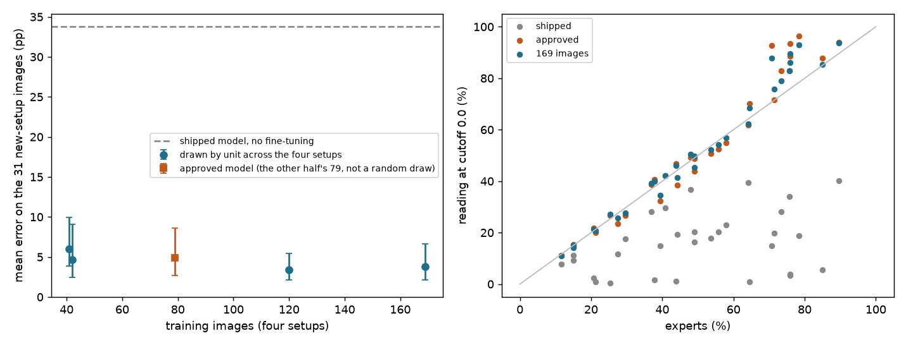

# More training images: does fine-tuning on 169 images read new setups better than on 79?

**Status: scored once (`02c860e`), from the readings committed in `cb62b3b`.** This file,
`scripts/confluency_more_images.py` and the training sets in `results/confluency_more_images_plan.json` were
committed (`e2df3b3`) before any model below was trained and before any fine-tuned model read any of the test
images. The results section was added afterwards by `scripts/confluency_more_images.py score`, run once; "What it
means" was written after it.

## Why

The approved fine-tuned model (`mcellseg_ftF_r2`, `configs/approved_changes.jsonl`) was trained on 79 images: the
calibration half of the sealed mCellSeg test's four setups, 5,723 outlined cells. Only 14 of them are at 60% or
above, the range where it fell short (`results/confluency_mcellseg.md`, `results/confluency_mcellseg_swap.md`).
All 169 labelled images of those setups hold 12,185 outlined cells, 36 of them at 60% or above.

Every one of the 169 has now been trained on or scored, so a model trained on all of them cannot be measured on
any of them. The questions are asked of the only mCellSeg images no fine-tuned model has read:

1. **(Primary)** Does a model fine-tuned on all 169 images read the 31 images of four other setups better than the
   approved model, trained on 79?
2. **(Reported, whatever it shows)** How does the approved model read setups it never trained on, against the
   shipped model? This is the question a lab adding a microscope would ask.
3. **(Reported, not judged)** How does the error change with the number of training images (about 40, 120, 169)?

## What was looked at before this was written

- All results of the sealed test and its swapped replication, per image.
- The 31 test images' expert confluency, from the masks: 11 at 60–90%, 2 at or above 80%, from 13 units; one
  unit (`polymer|test`) holds 9 of the 31 images.
- The shipped model's readings of the 31 at every cutoff are committed (`results/confluency_mcellseg_curves.json`,
  the zero-shot map, computed in `007422d`), and have been seen: a dry run of `score` on made-up fine-tuned
  readings used them. At cutoff 0.0 they read low on nearly every image (MAE 33.78 pp, 2 of 31 within 5 pp).
  They are an arm reported whatever it shows; nothing below was chosen after seeing them.
- No fine-tuned model has read any of the 31: they appear in none of the fine-tuned maps, the swapped
  replication's maps, the before/after picture's readings or the product-path records.

## Test images

The 31 mCellSeg images outside the four calibrated setups, both halves of the committed split
(`results/confluency_mcellseg_split.json`):

| Setup | Images | Grouped by (the TIFFs carry no instrument tags; `confluency_mcellseg.setup_of`) |
|---|---|---|
| `polymer_lowmag` | 13 | file names `CellsOnly_Polymer*`, `Polymer_Test*` |
| `bf_20x_3440` | 8 | 3440 × 3440 images |
| `jp_bf_2048` | 6 | 2048 × 2048 images |
| `huvec_bf_2752` | 4 | file names `BF-HUVEC*` |

None of these setups is among the four that any model here trained on. They are the same lab as the training
images, so this measures transfer to other microscope setups and formats of one lab, not to another lab.

## Models

All fine-tuned from Cellpose-SAM (`cpsam_v2`) with the function, labels and recipe that trained the approved model
(`confluency_finetune.train_run`, instance masks, learning rate 1e-5, weight decay 0.1, 100 epochs, batch size 1),
so the training images are the only difference.

| Run | Training images | How they are chosen |
|---|---|---|
| `mcellseg_ftF_r2` (approved) | 79 | the sealed test's calibration half; already trained, not retrained |
| `mcellseg_more_n169` (primary) | 169 | all labelled images of the four setups |
| `mcellseg_more_n40_s0`, `_s1` | 41, 42 | two seeded draws |
| `mcellseg_more_n120_s0` | 120 | seed 0; contains `n40_s0` |

- Draws are of whole units, in a seeded random order interleaved by setup, so every draw spans the four setups in
  proportion to their image counts, and sizes from one seed are nested.
- The approved model's 79 are not a random draw (one half of a density-balanced split). It is reported as its own
  point, not as part of the curve.
- **No separate "more varied" arm.** In these 169 images, setup and density go together (`lsm_2796` has 70 images,
  2 of them at 60% or above; `lsm_hek_1024` has 32, 15 of them). A comparison of equal size across fewer setups
  could not separate more setups from more dense images, and 31 test images could not resolve it. Every model is
  tested on four setups it never trained on, which is the variation this data can measure.

## Readings

Every reading is the share of pixels whose cell-probability logit is above 0.0, the cutoff the product reads a
fine-tuned model at (`configs/finetuned_models.yaml`). These setups have no calibration profile and too few
images for one, so no arm is calibrated. The shipped readings are the committed zero-shot readings at 0.0. Images
are read as in the sealed test (`confluency_mcellseg.gray`).

## Analysis, fixed now

- **Primary.** MAE(approved) − MAE(`mcellseg_more_n169`) on all 31 images, with a 95% interval from 10,000
  bootstrap resamples of units (`confluency_mcellseg.clustered`, seed 0).
  - Interval entirely above zero: **more images read these setups better.**
  - Interval entirely below zero: **more images read these setups worse.**
  - Interval includes zero: **not shown with these 31 images.** That is not evidence that more images do not
    help: with 13 units, one of them holding 9 images, a real gain can leave an interval that includes zero.
- **Reported beside it, not judged:**
  - the same contrast on the 11 images at 60–90% (7 units);
  - MAE(shipped) − MAE(approved) on all 31 and at 60–90%, reported whatever it shows;
  - for every model: MAE with its interval, mean signed error, images within 5 pp, MAE at 60–90%, and MAE per
    setup, so one setup cannot carry the headline unseen;
  - MAE against the number of training images, for the curve's draws and the approved model;
  - every image's reading from every model.
- Passage calls are not judged: 2 test images are at or above 80%.

## What follows, fixed now

- Nothing changes before the call, whatever the result: the product, the approved model, the demo and the site
  stay as they are.
- If more images read these setups better, `mcellseg_more_n169` becomes at most a proposal to the repository
  owner, and these 31 images are its only evidence. It would need its own change record before the product could
  show it.
- These are the last mCellSeg images that no fine-tuned model has read. They are scored once.
- Weights stay on the Colab runtime and in the owner's Drive. The results that come back are the curves file and
  the training manifests, no weights or images.

## How it runs

- Training and readings run on a Colab GPU (`nb/10_more_images.ipynb`), from a bundle of the commit that adds this
  file. The notebook checks the committed files byte for byte and the approved weights by SHA-256.
- Order: the approved model reads the 31 first (no training), then `mcellseg_more_n169` is trained and read, then
  the curve's runs. The curves file is rewritten and copied to Drive after each model, so a dropped session loses
  at most one model.
- Scoring runs once on the Mac: `.venv/bin/python scripts/confluency_more_images.py score`.

## Results (generated by `scripts/confluency_more_images.py score`, run once)

31 test images from 13 units, 11 of them at 60–90%. Every reading at cutoff 0.0. Intervals: 95%, bootstrap over units.

| Model | Training images | MAE, all (95% interval) | Mean signed error | Within 5 pp | MAE at 60–90% | MAE `bf_20x_3440` | MAE `huvec_bf_2752` | MAE `jp_bf_2048` | MAE `polymer_lowmag` |
|---|---|---|---|---|---|---|---|---|---|
| Shipped (zero-shot) | – | 33.78 (24.19–46.82) | -33.78 | 2 of 31 | 55.98 | 24.88 | 13.94 | 64.13 | 31.36 |
| Approved fine-tuned, 79 images (`mcellseg_ftF_r2`) | 79 | 4.88 (2.65–8.61) | +2.43 | 21 of 31 | 9.29 | 1.86 | 1.72 | 13.76 | 3.62 |
| Fine-tuned, 169 images (`mcellseg_more_n169`) | 169 | 3.81 (2.14–6.60) | +2.31 | 24 of 31 | 7.55 | 1.51 | 1.99 | 10.27 | 2.81 |
| Fine-tuned, 41 images (`mcellseg_more_n40_s0`) | 41 | 5.98 (3.83–9.93) | +2.41 | 19 of 31 | 10.05 | 3.41 | 3.41 | 14.80 | 4.27 |
| Fine-tuned, 42 images (`mcellseg_more_n40_s1`) | 42 | 4.67 (2.46–9.09) | +4.55 | 24 of 31 | 9.54 | 2.58 | 3.09 | 14.11 | 2.09 |
| Fine-tuned, 120 images (`mcellseg_more_n120_s0`) | 120 | 3.38 (2.10–5.47) | +1.79 | 24 of 31 | 6.45 | 1.90 | 1.82 | 8.23 | 2.52 |

Pre-registered contrast, MAE(approved) − MAE(mcellseg_more_n169) on all 31: +1.07 pp (+0.45 to +2.04). By the rule fixed in advance: **more images read these setups better**.
At 60–90% (reported, not judged): +1.75 pp (-0.06 to +3.48).

Approved fine-tuned model against the shipped model (reported, whatever it shows), MAE(shipped) − MAE(approved): +28.90 pp (+21.15 to +39.48); at 60–90% +46.69 pp.

| Image | Setup | Experts | Shipped | Approved | n169 | n41 s0 | n42 s1 | n120 s0 |
|---|---|---|---|---|---|---|---|---|
| `HEK_FUMGW_GFP_3_BF.tif` | bf_20x_3440 | 11.7 | 7.8 | 11.3 | 11.0 | 12.6 | 12.7 | 11.5 |
| `HEK_FUMGW_GFP_2_BF.tif` | bf_20x_3440 | 14.9 | 11.1 | 14.9 | 14.3 | 15.9 | 15.0 | 15.2 |
| `HEK_FUMGW_GFP_4_BF.tif` | bf_20x_3440 | 15.1 | 9.3 | 15.3 | 15.0 | 17.0 | 15.9 | 16.0 |
| `P4_si_20x_2_BF.tif` | bf_20x_3440 | 20.6 | 2.5 | 21.9 | 21.3 | 22.0 | 22.2 | 21.9 |
| `Lipo_20x_1_BF.tif` | bf_20x_3440 | 25.3 | 0.3 | 26.8 | 27.1 | 30.9 | 27.7 | 27.2 |
| `P3_si_20x_1_BF.tif` | bf_20x_3440 | 37.7 | 1.7 | 40.7 | 40.0 | 41.9 | 41.0 | 40.5 |
| `P4_Hep_20x_1_BF.tif` | bf_20x_3440 | 43.9 | 1.2 | 46.8 | 46.0 | 48.5 | 48.7 | 46.9 |
| `P3_Hep_20x_1_BF.tif` | bf_20x_3440 | 64.5 | 0.8 | 70.2 | 68.4 | 72.2 | 71.2 | 69.6 |
| `BF-HUVEC_Glx_Polymers-02_S135-0008.tif` | huvec_bf_2752 | 36.8 | 28.3 | 38.8 | 39.2 | 40.0 | 39.6 | 38.4 |
| `BF-HUVEC_Glx_Polymers-02_S132-0008.tif` | huvec_bf_2752 | 40.8 | 29.6 | 42.0 | 42.0 | 43.8 | 44.0 | 41.4 |
| `BF-HUVEC_Glx_Polymers-02_S131-0008.tif` | huvec_bf_2752 | 47.9 | 36.7 | 49.4 | 50.4 | 52.1 | 51.1 | 48.8 |
| `BF-HUVEC_Glx_Polymers-02_S132-0002.tif` | huvec_bf_2752 | 64.1 | 39.4 | 61.9 | 62.3 | 67.3 | 67.2 | 60.0 |
| `JP_Polymers_3h_17h_20x_P1_1_BF.tif` | jp_bf_2048 | 70.7 | 14.9 | 92.7 | 87.9 | 94.8 | 93.9 | 85.4 |
| `JP_Polymers_3h_17h_20x_CO_1_BF.tif` | jp_bf_2048 | 73.3 | 28.0 | 82.8 | 79.0 | 82.9 | 82.3 | 76.7 |
| `JP_Polymers_17h_20x_P2_1_BF.tif` | jp_bf_2048 | 75.8 | 3.3 | 88.5 | 86.0 | 88.6 | 88.8 | 84.0 |
| `JP_Polymers_17h_20x_CO_1_BF.tif` | jp_bf_2048 | 75.9 | 3.8 | 93.4 | 89.5 | 94.9 | 94.5 | 86.8 |
| `JP_Polymers_17h_20x_P1_1_BF.tif` | jp_bf_2048 | 78.5 | 18.9 | 96.4 | 93.0 | 97.8 | 96.7 | 88.8 |
| `JP_Polymers_17h_20x_P3_1_BF.tif` | jp_bf_2048 | 85.0 | 5.5 | 87.9 | 85.4 | 89.0 | 87.5 | 83.1 |
| `Polymer_Test_026.tif` | polymer_lowmag | 21.2 | 0.9 | 20.1 | 20.8 | 19.6 | 21.2 | 21.0 |
| `Polymer_Test_150.tif` | polymer_lowmag | 27.5 | 11.8 | 23.4 | 25.6 | 22.8 | 26.8 | 24.1 |
| `Polymer_Test_147.tif` | polymer_lowmag | 29.6 | 17.6 | 26.6 | 27.5 | 27.8 | 29.8 | 28.8 |
| `Polymer_Test_149.tif` | polymer_lowmag | 39.5 | 14.8 | 32.3 | 34.5 | 31.3 | 38.3 | 34.3 |
| `CellsOnly_Polymer-55.tif` | polymer_lowmag | 44.2 | 19.4 | 38.5 | 41.3 | 39.8 | 45.4 | 42.2 |
| `CellsOnly_Polymer-47.tif` | polymer_lowmag | 49.0 | 20.2 | 44.0 | 45.3 | 43.9 | 52.1 | 46.8 |
| `CellsOnly_Polymer_46.tif` | polymer_lowmag | 49.0 | 16.4 | 48.8 | 49.8 | 49.2 | 51.8 | 49.9 |
| `Polymer_Test_146.tif` | polymer_lowmag | 53.6 | 17.7 | 50.8 | 52.3 | 47.0 | 55.5 | 51.3 |
| `CellsOnly_Polymer-48.tif` | polymer_lowmag | 55.8 | 20.3 | 52.5 | 54.2 | 45.9 | 56.1 | 53.6 |
| `Polymer_Test_164.tif` | polymer_lowmag | 57.9 | 23.1 | 54.8 | 56.8 | 55.7 | 63.1 | 59.0 |
| `Polymer_Test_27.tif` | polymer_lowmag | 71.5 | 19.9 | 71.6 | 75.9 | 70.6 | 74.0 | 73.1 |
| `Polymer_Test_165.tif` | polymer_lowmag | 75.6 | 34.1 | 82.9 | 82.9 | 70.8 | 78.7 | 82.5 |
| `Polymer_Test_61.tif` | polymer_lowmag | 89.6 | 40.1 | 93.9 | 93.7 | 84.5 | 94.6 | 93.5 |

## What it means

- **The rule fixed in advance is met, by about 1 pp.** On the 31 images of four setups none of these models trained
  on, the model fine-tuned on all 169 images reads with a mean error of 3.81 pp, against 4.88 pp for the approved
  model (79 images): +1.07 pp (+0.45 to +2.04), and 24 of 31 within 5 pp against 21.
- **The interval covers which test images were drawn, not how training went.** Each model was trained once. The two
  draws of about 40 images, same recipe, differ by 1.31 pp (5.98 and 4.67), more than the gain. The result holds
  for these two trained models; another training run on the same 169 images could land closer to the approved
  model. The curve falls from about 40 images to about 120 (3.38) and is flat beyond that within this variation:
  the 169-image model (3.81) does not beat the 120-image one. The 120-image model is not a candidate: only the
  169-image model was named before the readings, and choosing another now would be choosing on the test images.
- **Mostly one setup.** Of the 1.07 pp, 0.68 comes from `jp_bf_2048` (6 images, 4 units) and 0.34 from
  `polymer_lowmag` (13 images, 2 units); `bf_20x_3440` adds 0.09 and `huvec_bf_2752` −0.03.
- **On `jp_bf_2048` the 169-image model is less wrong, not right.** These 6 images are dense (experts 70.7–85.0%),
  and both models read all 6 high: the approved model by 13.76 pp on average (70.7% read as 92.7% on
  `JP_Polymers_3h_17h_20x_P1_1_BF.tif`), the 169-image model by 10.27 pp. Of the five the experts put at 70–79%,
  the approved model reads all five above an 80% passage target and the 169-image model four. At 60–90% the gain
  is +1.75 pp with an interval that includes zero (−0.06 to +3.48); that contrast was reported, not judged.
- **Transfer (question 2).** On setups it never trained on, the approved model reads with a mean error of 4.88 pp,
  against 33.78 pp for the shipped model at the cutoff the product uses for an uncalibrated setup (0.0): +28.90 pp
  (+21.15 to +39.48). The shipped model reads low on every one of the 31; the approved model reads slightly high on
  average (+2.43 pp), and 10 pp or more high on most of the dense `jp_bf_2048` images. These are four other setups
  of the same lab, not another lab.
- **What follows, as fixed before scoring.** Nothing changes before the call: the product, the approved model, the
  demo and the site stay as they are. `mcellseg_more_n169` is at most a proposal to the repository owner, and these
  31 images are its only evidence: they were the last mCellSeg images no fine-tuned model had read, and it trained
  on every image of the sealed test, so it has no sealed-test result of its own. It would need its own change
  record before the product could show it. Its weights are in the owner's Drive (SHA-256 `80ac7c01eb66…`), not in
  the repository.
- Training ran on an NVIDIA L4: 2.2 hours for the 169-image model, 4.8 hours for all four.

## Addendum, 2026-10-08 (written after scoring; nothing above is changed)

On 2026-10-08 the repository owner chose to show the approved fine-tuned model, `mcellseg_ftF_r2`, unchanged, in
the public console's demo set: four mCellSeg test images get its reading beside the shipped one, and it decides
nothing (`demo/lab_demo.py`, `CHANGELOG.md`). That changes the demo before the call, which "What follows" above
said would not happen. The decision does not rest on this test. `mcellseg_more_n169` is not used anywhere, and the
model shown is the one approved in `configs/approved_changes.jsonl` before this test was scored.
